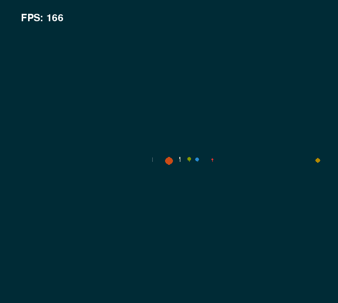

# N-Body-Simulation
This program simulates a 2D system of massive bodies using a simple Euler-Richardson algorithm.
Either "dust cloud" of 30 random objects or a preset toy model of the Solar System (including Halley's Comet) can be generated.

Press "r" to launch the "dust cloud" mode, and "s" to launch the Solar System mode. In "dust cloud" mode the view can be zoomed with the arrow keys.

Planets will coalesce into one larger mass if they collide with each other, conserving momentum and blending their colours together (the blending power is proportional to the mass)

Please note that the radii are for visualisation only and are not to scale - they are logarithmically proportional to the actual masses in the dustcloud mode, and preset in the Solar System mode..

---------

