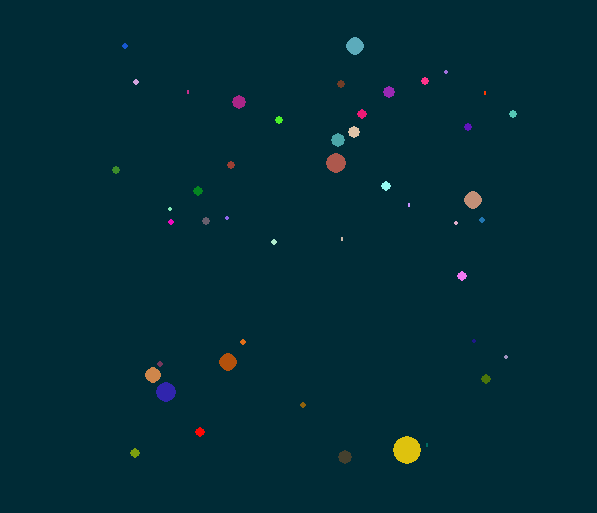

# N-Body-Simulation
This program simulates a 2D system of massive bodies using a simple Euler-Richardson algorithm.
Either "N" planets can be generated, with randomized masses, initial positions, and initial velocities, or a preset toy model of the Solar System can be generated.

Planets will coalesce into one larger mass if they collide with each other, conserving momentum and blending their colours together (the blending power is proportional to the mass)

Please note that the radii are for visualisation only and are not to scale - they are logarithmically proportional to the actual masses.

